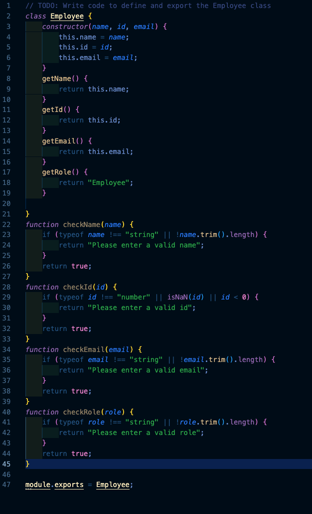
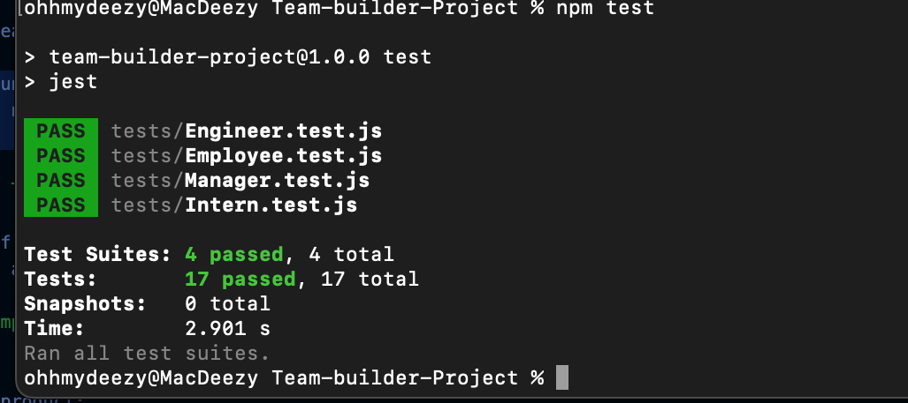

# Team-builder-Project

## Table of Contents: 
* [sources](#sources)
* [Installation](#installation)
* [Usage](#usage)
* [Credits](#credits)
* [License](#license)

Sources

For this task, using Node, we needed to create an App that Dynamically creates a HTML page with cards for a team using CLI input from the user. There were a number of elements provided by the university as the starter code which required cmpleting the functionality to ensure that each feature was working as expected. From there, the following code was completed using research on StackOverflow, Google & ChatGPT on occasion.

Installation: 

For this task, There are no HTML files as the HTML will be created once the user's CLI input is registered. Based on this, The completed test folder was provided, In the lib folder, the files were provided, however, the files were completed and the functions were completed and exported. In additon to this the index.js file was provided, however, the functioning was not completed. In additon to this, the node modules were not provided. 

The focus was the Javascript pages, however the provided files needed to be transferred to a new Repo.

Step 1: Creating a Repo. 

In this step, Create a Repo which also has a readMe file attached.

Step 2: creating the folders and files for the repo:

There was no CSS file provided, so that was something that needed to be created, This step required creating a CSS alter the default boostrap filing to create a personalised touch to the prject, this was done using "touch<file name>".css.

Step 3: Creating the code: 

starting with the base code HTML Code:

Each js file in the lib file was empty so the functionality of these needed to be created, this was done from initially building out the employee script and then the following engineer, intern, manager pages are all an extension of the employee pages with similar functionality.

Step 4: Creating the prompts

Once the functions were completed, the following step was to ensure that all of the tests returned success and there were no errors for each individual employee type. This was done by calling the different tests that were provided.

Once all of the elemeents were built, the next step was to run node to check if all of the components are functional and the output is producing the intended functionality.

The final product: 

Usage: 

    The page can be used to quickly build out a simple page for a project based on team-work.

Credits: 

    Repo is made by myself,  the basic code provided by the University, came with completed test files, partially complete page-template.js, other than this  the code thereafter was created with the help of my colleagues, the help of teaching assistants and research completed on mdn web docs and stack overflow and a healthy dose of chatGPT.

License:

    See License in Repo